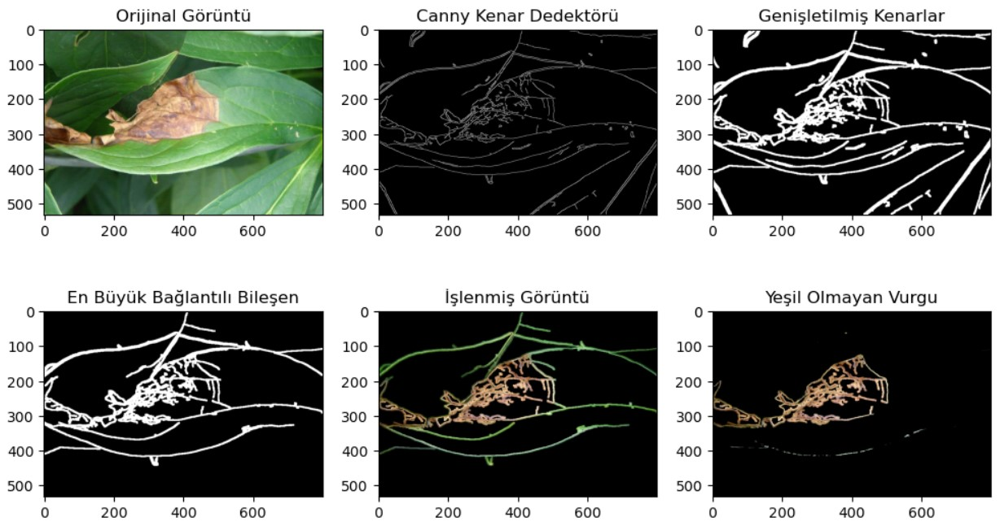
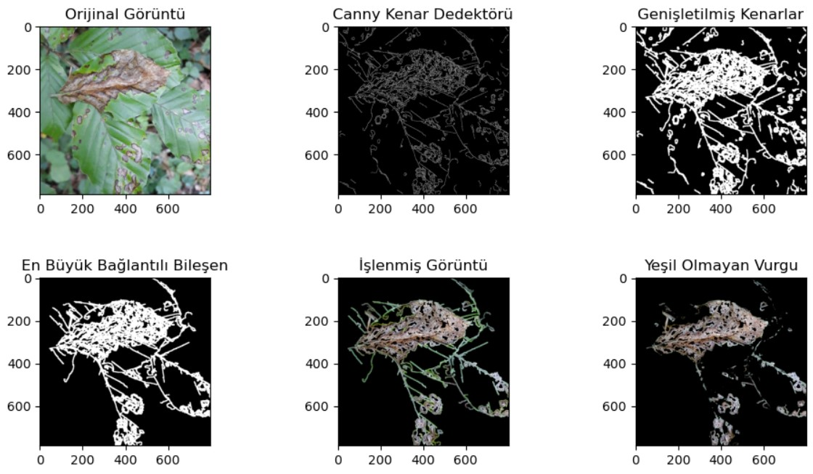
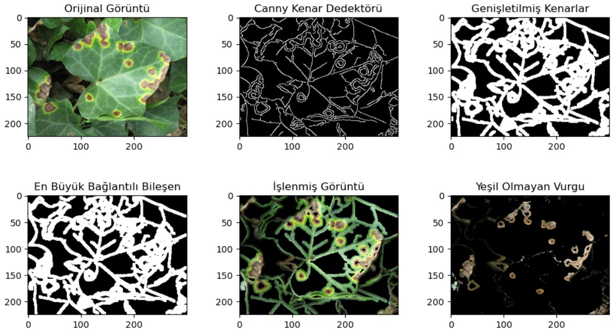
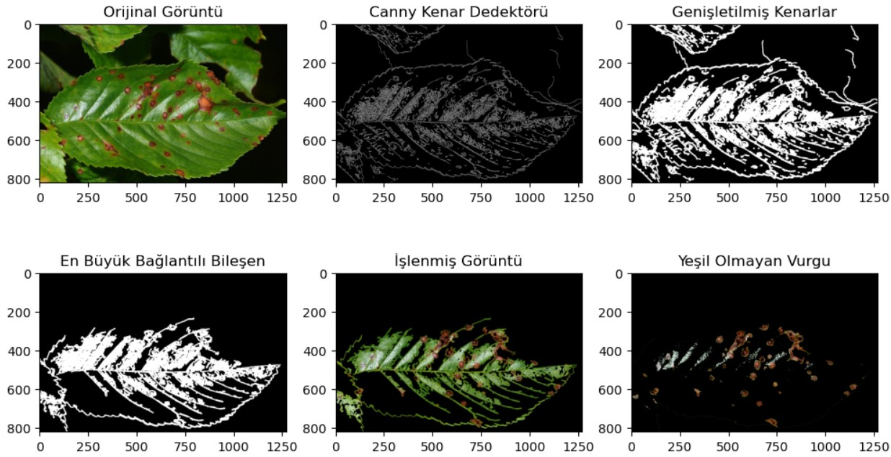
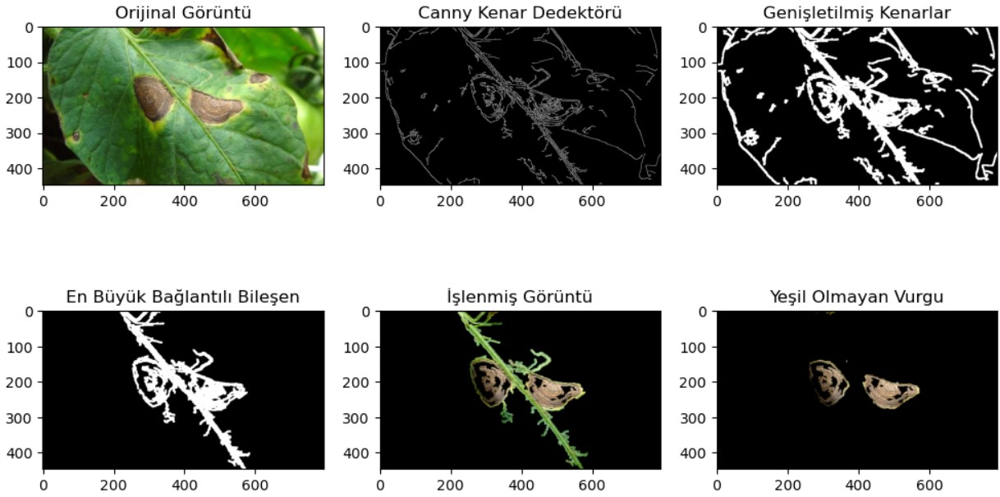
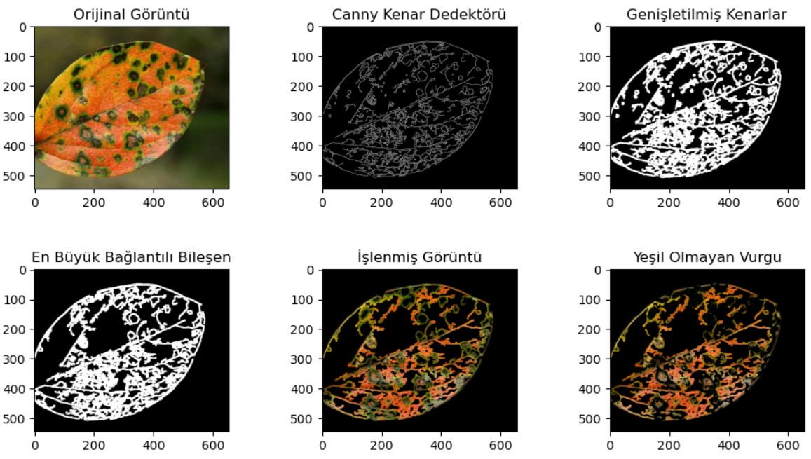

# Detection-of-Diseases-on-Plant-Leaves-using-Image-Processing
# ABSTRACT (ÖZET)

Bitki yapraklarındaki hastalıklar, nüfus artışına bağlı olarak gıda talebinin artmasıyla birlikte tarım sektörünün temel bir sorununu oluşturur. Bu hastalıkların erken ve doğru bir şekilde tespit edilememesi, bitkiler üzerinde ciddi etkiler yaratır ve ürün kalitesini, miktarını ve verimini olumsuz yönde etkiler. Geliştirilen görüntü işleme teknikleri ile bitki yapraklarındaki hastalıkların otomatik olarak tespit edilmesi, tarım verimliliğini artırarak gıda güvenliği ve ekonomik sürdürülebilirlik açısından önemli bir rol oynar.

##  ANAHTAR KELİMELER
## Hastalık Tespiti, Görüntü işleme, Gürültü Azaltma, Kenar Tespiti, Segmentasyon

Görüntü işleme algoritması, sayısal görüntü işleme tekniklerini içeren bir fonksiyon içermektedir. İlk olarak, verilen bir görüntü dosyası OpenCV kütüphanesi kullanılarak okunmuş gri tonlamaya çevirilip ardından Gauss filtresi ve Canny kenar dedektörü uygulanmıştır. Daha sonra, kenarları birbirine bağlamak için genişletme işlemi (dilation) gerçekleştirilmiştir. Bağlantılı bileşen analizi kullanılarak görüntüdeki bağlantılı bileşenler tespit edilmiştir ve en büyük bileşen (genellikle yaprak) belirlenmiştir. Belirlenen bileşen maskeleme işlemiyle orijinal görüntüden izole edilmiş ve HSV renk uzayına dönüştürülmüştür. Bu işlemin ardından, yeşil renk aralığına uygun bir maske oluşturulmuş ve bu maske tersine çevirilerek yeşil olmayan bölgeleri vurgulanmıştır. Bu bölgeler hastalıklı kısımlar olarak tespit edilmiştir. Sonuçları görselleştirmek için matplotlib kütüphanesi kullanılarak işlemin her adımı yan yana gösterilmiştir.

### Sonuçlar
## 1

## 2

## 3

## 4

## 5

## 6

## 7

## 8

